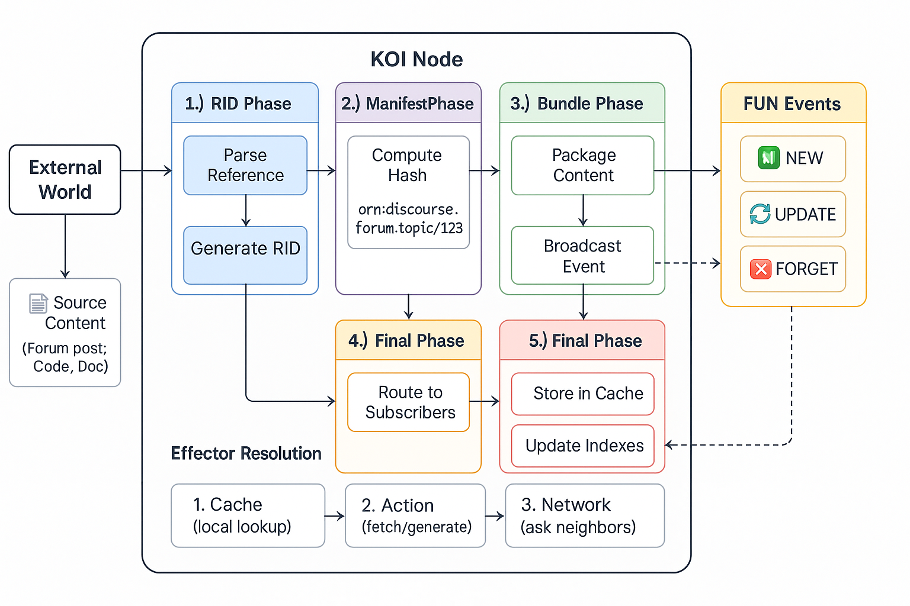
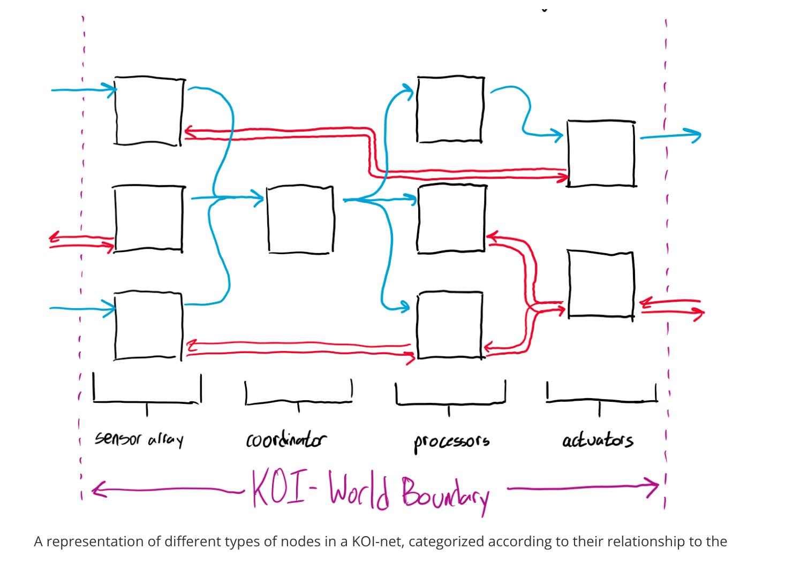
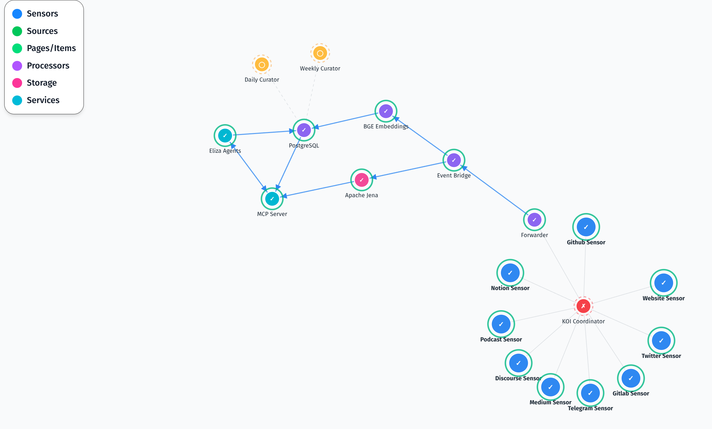
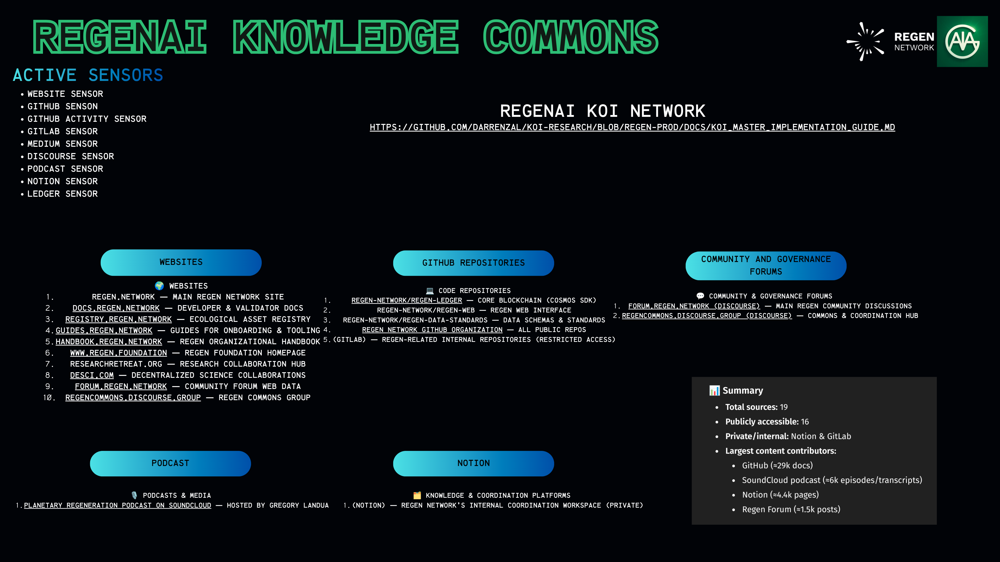
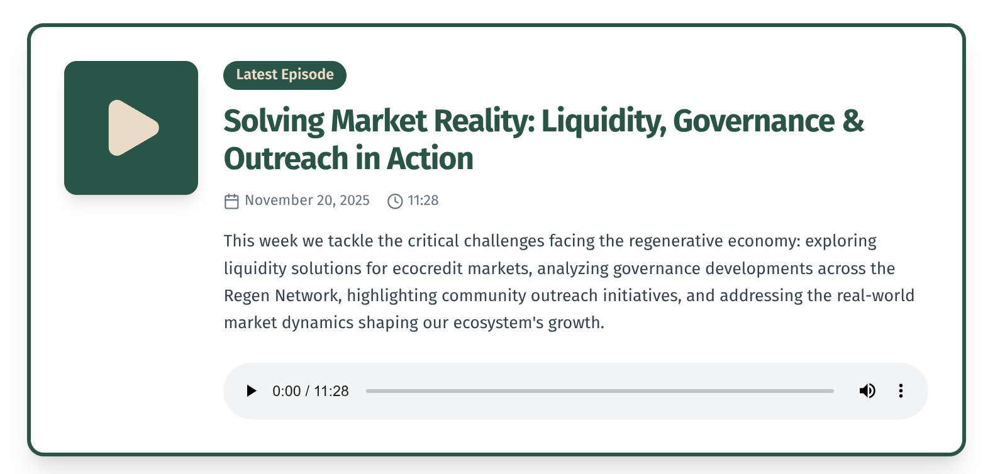
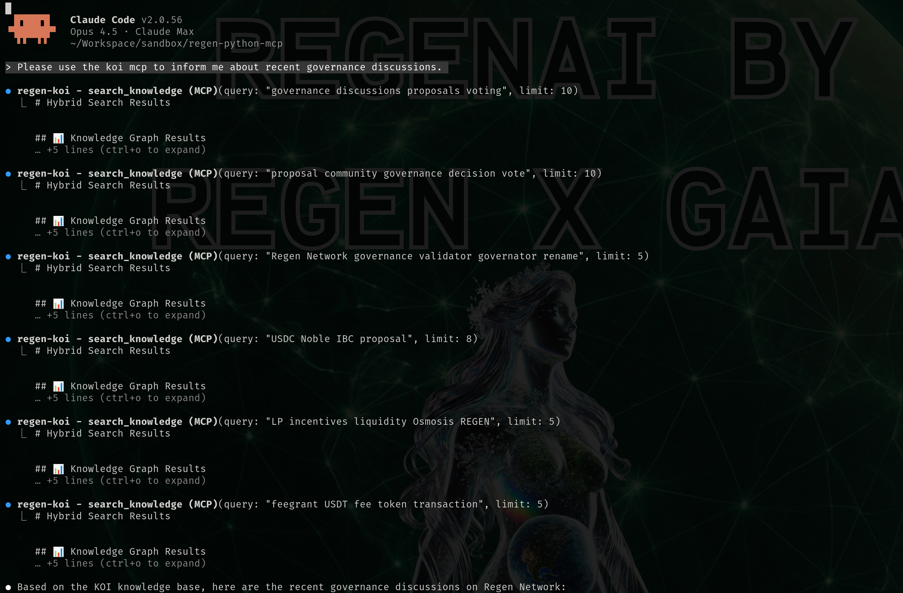
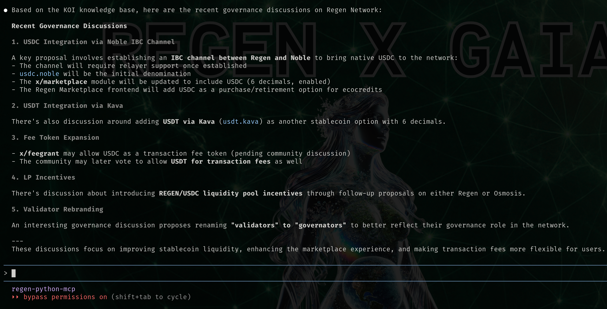
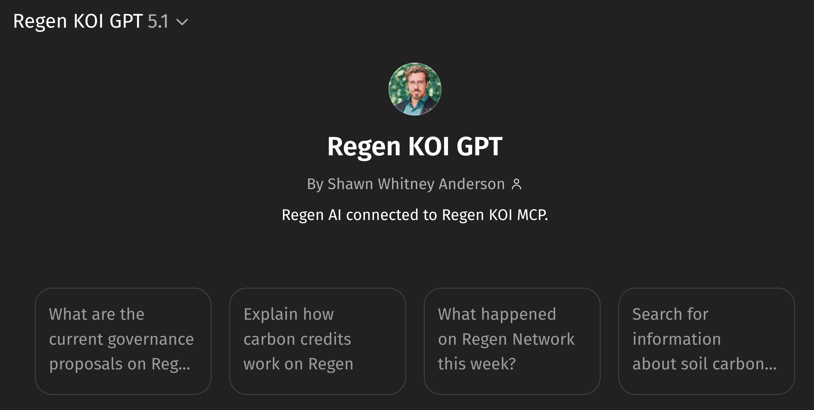
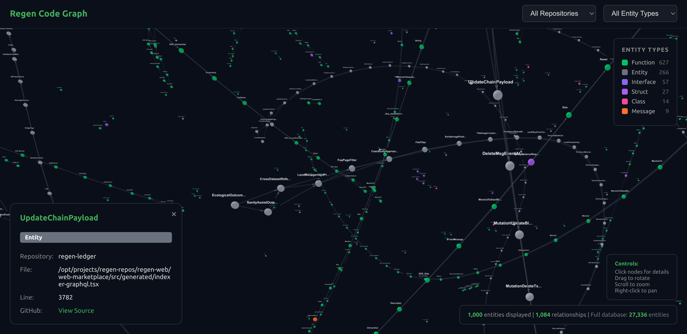

# The Knowledge Brain of Regeneration


# [Week 2/12] Regen AI Update: KOI MCP Deep Dive - November 25, 2025

* **Posted by:** Shawn Anderson (Gaia AI)
* **Key Focus:** How 15,000+ documents become a living planetary intelligence network through Knowledge Organization Infrastructure

---
## Quickstart:

To get started with the KOI Regen MCP, test it out with the KOI Regen GPT:
**[Launch Regen KOI GPT →](https://chatgpt.com/g/g-692f3c6bc5e48191b3d1721f4a8ccdec-regen-koi-gpt)**

To learn additional ways of connecting to the Regen KOI network see the [Tutorial Section below](#tutorial-connect-to-the-koi-brain).
## From Data to Wisdom: A Journey Into the Mycelial Mind

*Today's information environment is defined by a strange inversion:* "Instead of inhabiting a shared reality from which a variety of knowledge objects emerge, we inhabit a variety of realities that each emerge from a particular collection of knowledge objects their inhabitants hold in common." — BlockScience, [A Preview of the KOI-net Protocol](https://blog.block.science/a-preview-of-the-koi-net-protocol/) (2024)

Last week, we introduced [Regen AI's three foundational MCP servers](https://forum.regen.network/t/announcing-regen-ai/553). This week, we descend into the mycelium—the vast underground network that connects everything in the forest of regenerative knowledge. Welcome to the Regen KOI MCP: the knowledge brain that transforms scattered documents into planetary intelligence.

**KOI—Knowledge Organization Infrastructure—is a [specification](https://github.com/BlockScience/koi-net) created by [BlockScience](https://block.science/)**, the complex systems engineering and R&D firm, in partnership with [Metagov](https://metagov.org/) and [RMIT](https://www.rmit.edu.au/). Their research represents a fundamental breakthrough in how distributed organizations can establish shared knowledge while preserving autonomy. We're honored to be among the first to implement their protocol at scale, building what may be the most comprehensive knowledge infrastructure in the regenerative economy. What BlockScience designed as a theoretical framework, we've transformed into a living nervous system for planetary intelligence. 

KOI is more than a database, it's a living nervous system for regenerative knowledge. When we talk about creating a "legibility layer" for ecological data, we're describing something profound: the ability for any agent to ask questions to the regenerative economy and receive coherent, contextualized answers. *What methodologies have proven most effective for old growth forest conservation? How has the Regen community's thinking evolved on biodiversity credits? What patterns emerge when we trace the connections between projects, people, and protocols?*

These questions require more than search. They require understanding.

---

## The Fragmentation Crisis

Consider the challenge facing anyone entering the regenerative space today. Where does one begin?

The Regen ecosystem sprawls across:
- **[Forum discussions](https://forum.regen.network)** spanning years of governance debates and community insights
- **[Technical documentation](https://docs.regen.network)** for the ledger, registry, and data modules
- **[Methodology specifications](https://registry.regen.network/methodologies)** for carbon, biodiversity, and soil health credits
- **[Blog posts and newsletters](https://medium.com/regen-network)** capturing evolving thought leadership
- **[Community calls](https://www.youtube.com/@RegenNetwork)** where decisions are made in conversation
- **[GitHub repositories](https://github.com/regen-network)** where code embodies intention
- **[Podcast transcripts](https://open.spotify.com/show/1JfD8QvTtpMUtK15CGekbu)** distilling hours of wisdom into accessible narrative

This knowledge doesn't just exist—it *lives*. It changes. It connects in ways that no single document can capture. A governance proposal from 2023 references a methodology document that informed a credit class that now has dozens of active projects generating insights that feed back into new proposals.

The tragedy? Most of this knowledge exists in silos. Each piece knows nothing of the others. The collective intelligence remains latent, waiting to be woven together.

This is where KOI enters—not as a database, but as a *nervous system*.

---

## Understanding KOI: Beyond Search, Toward Sense-Making

KOI stands for **Knowledge Organization Infrastructure**. It emerged from research by BlockScience in partnership with Metagov and RMIT, designed to help "distinct actors construct a shared reality from which they can collaborate."

The fundamental insight is profound: **knowledge coordination precedes action coordination**. Before we can act together on planetary-scale challenges, we must first establish common understanding—not by forcing agreement, but by making our respective knowledge legible to one another. At its heart, KOI embodies a radical proposition: **knowledge itself should be decentralized, versioned, and self-organizing** - just like the ecological systems we seek to regenerate.

The KOI protocol draws inspiration from how mycorrhizal networks share resources between trees. In a forest, information about nutrients, water stress, and threats flows through fungal highways connecting root systems. No central controller directs this flow - it emerges from the network topology itself. KOI works similarly. Rather than a monolithic database controlled by a single entity, KOI creates a **federation of knowledge nodes** that discover each other, negotiate relationships, and broadcast updates through event propagation. When new knowledge enters the system - a forum post, a methodology update, a governance proposal - it ripples outward through the network, transformed and enriched at each step.

This is infrastructure for the Symbiocene: technology that mirrors natural patterns of distributed intelligence.

## How KOI Actually Works: A Technical Journey

Understanding KOI requires tracing the path of knowledge from its source to its use. Unlike traditional databases that store static records, KOI treats knowledge as a living flow—continuously updated, cryptographically verified, and semantically connected. The protocol operates through four interlocking systems: **identifiers** that name knowledge unambiguously, **bundles** that package it for transport, **events** that signal changes, and **pipelines** that process it intelligently.

What follows is a technical journey through each layer, from the atomic unit of a Resource Identifiers to the emergent topology of a knowledge network. For developers, this is a blueprint. For everyone else, it's a window into the machinery that makes planetary intelligence possible.


*A KOI node's internal architecture: identity, cache, effector, graph, pipeline, processor, and network interface working together to process and route knowledge through the network.*

### The RID Protocol: Every Piece of Knowledge Has a Name

At KOI's foundation lies the **Resource Identifier (RID) protocol**. Every document, every post, every piece of knowledge receives a unique identifier—not a random UUID, but a meaningful reference that captures *how* we refer to the content. RIDs are unique, permanent addresses in the global knowledge space. RIDs use the ORN (Object Resource Name) format

```
orn:discourse.forum.regen.network:topic/12345
orn:github.com:regen-network/regen-ledger/blob/main/README.md
orn:web.page:registry.regen.network/carbon-credits
```

These RIDs create a shared vocabulary. When an AI agent references a piece of knowledge, any other agent (or human) can locate exactly the same source—no ambiguity, no hallucination, just verifiable citation. These aren't just identifiers—they're *commitments*. When you reference an RID, you're pointing to a specific piece of knowledge that can be resolved anywhere in the network through the **effector system** (the component responsible for turning an RID into actual content). The effector tries three strategies in sequence:

1. **Cache** - Do I already have this locally?
2. **Action** - Can I generate or fetch it myself?
3. **Network** - Ask neighbors who might know

This pattern of local-first with network fallback mirrors how biological systems conserve energy while maintaining resilience.

Knowledge travels in **Bundles** - containers with two parts:
- **Manifest**: Metadata describing the content (hash, timestamp, source, type)
- **Contents**: The actual knowledge payload

The manifest's cryptographic hash ensures integrity: you can verify that knowledge hasn't been tampered with as it flows through the network.

With identifiers and bundles established, the next question is: how do nodes communicate changes?

### The FUN Event System: Knowledge That Breathes

KOI networks communicate through events, forming the "FUN" triad:

* **FORGET** - This knowledge is no longer valid; remove it from your understanding
* **UPDATE** - This knowledge has changed; here's the new version
* **NEW** - This knowledge didn't exist before; add it to your understanding

These aren't database operations—they're *signals*. When a new forum post appears, the Discourse sensor emits a NEW event. Other nodes in the network decide independently how to respond. One might index it for search. Another might extract entities for a knowledge graph. A third might ignore it entirely if it's outside its domain of interest.

This event-driven architecture means KOI networks are **living systems**. They respond to changes in real-time. They're decentralized by design—no central authority decides what's important. Each node maintains autonomy while contributing to collective intelligence.

When a sensor detects that docs.regen.network has changed, it emits an UPDATE event. This event flows through the **knowledge pipeline** - a five-phase processing system:

```
RID Phase → Manifest Phase → Bundle Phase → Network Phase → Final Phase
```

At each phase, **handlers** can inspect, transform, enrich, or block the knowledge object. For example:

* The **RID handler** blocks events about yourself (prevents infinite loops)
* The **Manifest handler** compares timestamps and hashes to detect actual changes
* The **Edge negotiation handler** manages relationships between nodes
* The **Network output handler** routes updates to interested subscribers

This pipeline architecture means nodes can customize their knowledge processing without breaking protocol compatibility. A methodology-focused node might add handlers that extract entity relationships, while a governance-focused node might prioritize proposal content.

While the pipeline processes individual events, the broader question remains: how do nodes discover each other and coordinate who sends what to whom?

### The NetworkGraph: Knowledge Topology

Each node maintains a **NetworkGraph** using directed graph structures. This graph answers questions like:

* Which nodes subscribe to my updates?
* Which nodes should I poll for knowledge?
* What's the shortest path to reach a particular knowledge source?

The graph isn't static - it evolves through **edge negotiation**. When two nodes want to establish a relationship, they exchange proposals specifying:

* **Edge type**: Provider (I'll send you knowledge) or Subscriber (I want your knowledge)
* **RID filter**: What kinds of knowledge flow through this edge?
* **Capabilities**: What can each node offer?

This negotiation happens automatically through the pipeline's edge handlers. The result is a self-organizing topology where knowledge flows efficiently to where it's needed.

### The Node Architecture

Every participant in the KOI network is a **node**. The `NodeInterface` class serves as the embodiment of each node, wiring together multiple interconnected subsystems:

```
NodeInterface
├── identity      (who am I in the network?)
├── cache         (what do I remember locally?)
├── effector      (how do I resolve references?)
├── graph         (who do I know, and how?)
├── pipeline      (how do I process knowledge?)
├── processor     (how do I handle specific events?)
└── network_interface (how do I communicate?)
```

Nodes come in two types:

**Full Nodes** operate as web servers, receiving knowledge through webhooks. They maintain persistent connections and can broadcast to many subscribers simultaneously. Think of these as the major hub cities in a transportation network.

**Partial Nodes** operate as web clients, polling for updates. They're lighter weight and can run anywhere - in a browser, a mobile app, or an AI agent's runtime. These are the local stations that keep smaller communities connected.

This hybrid architecture means KOI can scale from a single laptop running a sensor to a global network processing millions of knowledge updates daily.

### Nodes, Sensors, Processors, Actuators: The Anatomy of a KOI Network


*Different types of nodes in a KOI-net, categorized by their relationship to the boundary between the network and the external world. Image created by Luke Miller for BlockScience. [Source](https://blog.block.science/a-preview-of-the-koi-net-protocol/)*

The KOI-net protocol defines several node types, categorized by their relationship to organizational boundaries:

**Sensor Nodes** sit at the boundary, reaching into the external world:
- Website sensors crawl documentation sites
- Discourse sensors monitor forum activity
- GitHub sensors track repository changes
- Podcast sensors index audio transcripts

**Processor Nodes** operate internally, transforming knowledge:
- Embedding processors generate semantic vectors for search
- Graph processors extract entities and relationships
- Curator processors synthesize daily and weekly digests

**Coordinator Nodes** facilitate discovery and routing:
- They help new nodes find the network
- They route events between nodes
- They maintain the network graph

**Actuator Nodes** push information back out:
- They publish digests to external platforms
- They generate podcasts from synthesized content
- They feed AI agents that engage with communities

The beauty of this architecture is its **fractal nature**: a network of nodes can itself appear as a single node to an external observer. Regen's entire KOI infrastructure could be one "knowledge node" in a larger planetary KOI network connecting multiple regenerative organizations.

*To learn more: [KOI Nodes as Neurons](https://blog.block.science/koi-nodes-as-neurons/) and the [KOI-net Protocol Spec](https://github.com/BlockScience/koi-net)*

---

## The Regen KOI Network: A Living Map


*The complete architecture of RegenAI's Knowledge Organization Infrastructure—from sensors at the edge to intelligent agents at the center.*

The diagram above reveals a production system that has evolved significantly since our initial deployment. What began as a simple document search has grown into a sophisticated knowledge processing pipeline spanning eight sensors, three storage layers, and multiple intelligence services. Let's trace the flow from the network's edges toward its intelligent center.

### Sensors: The Network's Eyes and Ears (Blue)

At the periphery of the network, eight specialized sensors continuously monitor the Regen ecosystem. Each sensor is purpose-built for its platform, understanding the nuances of how that platform structures and delivers content:

| Sensor        | What It Monitors                                            |
| ------------- | ----------------------------------------------------------- |
| **Discourse** | Forum discussions, governance proposals, community Q&A      |
| **GitHub**    | Code changes, issues, PRs across 5+ repositories            |
| **Website**   | Documentation at docs.regen.network, registry.regen.network |
| **Podcast**   | Planetary Regeneration Podcast (68+ transcribed episodes)   |
| **Medium**    | Regen Network blog posts and thought leadership             |
| **Notion**    | Internal documentation and research notes                   |
| **Twitter**   | Community conversations and announcements                   |
| **Telegram**  | Channel updates and group discussions                       |

Each sensor speaks the KOI protocol natively, emitting events whenever content changes. When someone posts a new governance proposal on the forum, the Discourse sensor detects it within minutes and emits a NEW event. When that post is edited, an UPDATE event follows. If it's deleted, a FORGET event signals that the knowledge should be removed from downstream caches.

These sensors are what the KOI protocol calls "partial nodes"—they observe and report but don't serve queries directly. This lightweight design means sensors can run anywhere, from cloud servers to edge devices, scaling horizontally as the ecosystem grows.

### The Coordination Layer (Purple)

All sensor events flow inward to the coordination layer, where three components work together to manage the knowledge pipeline:

**KOI Coordinator** sits at the center of the sensor array, serving as the central routing hub where all events converge. It maintains a registry of every node in the network, tracks their health through periodic heartbeats, and routes events to the processors that need them. When a new sensor comes online, it registers with the Coordinator and immediately becomes part of the knowledge network.

**Forwarder** bridges the Coordinator to the processing pipeline. It ensures reliable event delivery with confirmation tracking—if the Event Bridge is temporarily unavailable, the Forwarder queues events and retries until delivery succeeds. This resilience means no knowledge is lost even during system maintenance.

**Event Bridge** is the workhorse of the entire system. Every piece of knowledge passes through here, where several critical operations occur:
- *Deduplication*: The same content might arrive from multiple sensors (a Medium post that's also shared on Twitter). The Event Bridge recognizes duplicates by their content hash and processes each piece of knowledge exactly once.
- *Versioning*: When content changes, the Event Bridge doesn't overwrite—it creates a new version and marks the previous one as superseded. This preserves the full history of how knowledge evolved.
- *Chunking*: Long documents are split into smaller chunks (1000 characters with 200-character overlap) optimized for embedding and retrieval.
- *Provenance*: Every transformation generates a CAT (Content Addressable Transformation) receipt, creating an auditable chain from source to storage.

### Processing: From Text to Intelligence (Purple)

Two specialized processors transform raw content into queryable knowledge:

**BGE Embeddings** converts text into 1024-dimensional semantic vectors using the BAAI/BGE-large-en-v1.5 model. These vectors are mathematical representations of *meaning*—documents about similar concepts cluster together in vector space even when they use different words. This is why searching for "soil carbon sequestration" also surfaces documents about "carbon farming" and "regenerative grazing"—the model understands these concepts are related.

**Tree-sitter AST Parser** is our newest addition, enabling deep code intelligence. Rather than treating source code as plain text, it parses code into Abstract Syntax Trees that understand programming language structure. From these trees, it extracts typed entities: Methods, Functions, Structs, Interfaces, and Cosmos SDK-specific constructs like Keepers, Messages, and Queries. This is what powers questions like "Which Keeper handles MsgCreateBatch?" or "What functions call the credit retirement handler?"

### Three Storage Layers (Pink)

Perhaps the most distinctive aspect of our architecture is maintaining **three complementary knowledge stores**, each optimized for different query patterns:

**PostgreSQL + pgvector** serves as the semantic layer. Over 15,000 document chunks live here, each paired with its BGE embedding vector. When you ask a question, your query is embedded into the same vector space, and pgvector finds the chunks whose meaning most closely matches. This is fast (sub-second queries) and intuitive—you don't need to know the exact keywords, just the concepts you're interested in.

**PostgreSQL + Apache AGE** provides the code graph. Currently holding **27,414 code entities** across 7 repositories—from regen-ledger's Cosmos SDK blockchain to the KOI infrastructure itself—this graph database lets you traverse codebases structurally. Find all functions that call a particular method, identify which Keepers handle which Messages, and understand how modules depend on each other. The graph structure captures relationships that flat search simply cannot.

**Apache Jena Fuseki** maintains the knowledge graph with approximately 101,903 RDF triples. This is where we store semantic relationships between entities: which methodologies apply to which credit classes, who authored which documents, what projects implement which approaches. The SPARQL query language enables complex reasoning—finding all projects that use a particular methodology AND were registered in 2024 AND involve soil carbon.

### Intelligence Services (Cyan)

The intelligence layer is where knowledge becomes accessible to both humans and AI:

**MCP Server** provides the unified interface that AI agents use to query the knowledge network. When you ask Claude a question about Regen Network, the MCP Server orchestrates queries across all three storage layers in parallel. Vector search finds semantically relevant documents. Graph queries surface structured relationships. SPARQL retrieves precise facts. The results are fused using Reciprocal Rank Fusion (RRF), which intelligently combines rankings from different sources into a single, coherent response—complete with citations back to primary sources.

Any MCP-compatible client can connect: Claude Desktop, Claude Code, VSCode with Copilot, Cursor, Windsurf, and many others. This means the entire Regen knowledge network is accessible from whatever AI tool you prefer.

**Eliza Agents** are autonomous AI personalities that use this knowledge to engage with communities directly. Five agents currently operate: RegenAI (the primary assistant), Voice of Nature (ecological perspective), Governor (governance focus), Advocate (community outreach), and Narrative (storytelling). Each agent can answer questions, generate content, and participate in discussions—grounded in the verified knowledge from KOI rather than hallucinating responses.

### Curation Layer (Dashed)

Finally, two curator services synthesize the constant flow of knowledge into digestible summaries:

**Daily Curator** analyzes each day's knowledge changes, looking for patterns and highlights. It identifies governance-related posts, flags significant technical updates, and prepares summaries for stakeholders who want to stay informed without reading everything.

**Weekly Curator** takes a longer view, synthesizing seven days of activity into comprehensive digests. These digests capture the arc of ongoing discussions, track how proposals evolve, and identify themes emerging across the ecosystem. The Weekly Curator's output powers the automated podcasts at [digest.gaiaai.xyz](https://digest.gaiaai.xyz/), transforming a week of community activity into a coherent audio narrative.

*To learn more: [KOI Master Implementation Guide](https://github.com/DarrenZal/koi-research/blob/regen-prod/docs/KOI_MASTER_IMPLEMENTATION_GUIDE.md)*

---

## How Knowledge Flows: A Day in the Life

Let's trace a piece of knowledge through the network:


*How posting in the community forums or making contributions to Github will trigger cascading contributions to the Regen Knowledge Commons.*

**9:00 AM**: Gregory posts a new governance proposal on forum.regen.network about adjusting credit class parameters.

**9:01 AM**: The Discourse Sensor detects the new topic. It generates an RID (`orn:discourse.forum.regen.network:topic/482`) and emits a NEW event containing the post content, author, timestamp, and category.

**9:02 AM**: The Event Bridge receives the event. It checks: have we seen this RID before? No—this is genuinely new. It routes the event to the embedding processor and the graph processor.

**9:03 AM**: The BGE Embeddings processor generates a semantic vector for the post content. This vector is stored in PostgreSQL alongside the text, making the post discoverable through semantic search.

**9:04 AM**: The graph processor extracts entities from the post: mentions of credit classes (C02), methodologies (VM0042), governance concepts (parameter changes). These are added to Apache Jena as RDF triples, linking this post to the broader knowledge graph.

**9:05 AM**: The Daily Curator notices this is a governance-related post. It flags it for inclusion in today's governance summary.

**9:06 AM**: An AI agent, asked "What's happening with credit class governance?", queries the MCP. The hybrid search finds Gregory's post (high semantic relevance to "credit class governance") and surfaces it with proper citation.

**End of Week**: The Weekly Curator aggregates this post with all other governance activity, generating a digest that feeds into an automated podcast episode.

Total time from post to searchable, graph-connected, citable knowledge: **under 5 minutes**.

---

## The Birth of Automated Regenerative Media

Perhaps the most remarkable demonstration of KOI in action is the automated weekly podcast.


*Visit [digest.gaiaai.xyz](https://digest.gaiaai.xyz/) to experience the first AI-generated Regen Network podcast—a synthesis of each week's activity across the entire ecosystem.*

### How It Works

The `generate_weekly_digest` function in the KOI MCP orchestrates this process:

1. **Time Window Definition**: The system identifies the date range (typically the past 7 days)

2. **Knowledge Aggregation**: It queries the KOI knowledge base for all content from that period—forum posts, governance updates, project announcements, technical changes

3. **Intelligent Synthesis**: Using LLM-enhanced processing, the raw content is transformed into a narrative structure with:
   - Executive summary of key developments
   - Governance activity breakdown
   - Project highlights and milestones
   - Community discussions worth noting
   - Technical updates and releases

4. **Podcast Generation**: The markdown digest feeds into NotebookLM's audio generation feature, which creates natural-sounding podcast episodes with AI-generated hosts discussing the week's developments

5. **Distribution**: The finished podcast publishes to the digest platform, RSS feeds, and podcast directories


---

## Tutorial: Connect to the KOI Brain

Ready to tap into this knowledge network yourself? Here's how to connect the KOI MCP to your AI workflow. RegenAI currently supports several ways to connect: Claude Code, our custom GPT, or via NPX for other environments like Claude Desktop. Additional platforms will be supported in the future. 

### Option 1: Claude Code



*Example queries and responses from the KOI MCP—showing how natural language questions return grounded, cited answers.*

1. Clone and build the Repository 
```bash
cd
mkdir regen-koi-mcp
cd regen-koi-mcp
git clone https://github.com/gaiaaiagent/regen-koi-mcp.git
cd regen-koi-mcp
npm install
npm run build
cd ..
```

2. Connect with Claude Code (In `~/regen-koi-mcp`)
Place the following in `~/regen-koi-mcp/.mcp.json`. Replace `USER` with your username on your system.
```json
{
  "mcpServers": {
      "regen-koi": {
        "command": "node",
        "args": ["/home/USER/regen-koi-mcp/regen-koi-mcp/dist/index.js"],
        "env": {
          "KOI_API_ENDPOINT": "https://regen.gaiaai.xyz/api/koi",
          "JENA_ENDPOINT": "https://regen.gaiaai.xyz/api/koi/fuseki/koi/sparql"
        }
      },
    }
}
```

Place the following in `~/regen-koi-mcp/.claude/settings.json`
```json
{
  "enableAllProjectMcpServers": true
}
```

3. In your terminal open claude (In `~/regen-koi-mcp`)
```
claude

# In claude verify the mcp is connected.
/mcp
```

You should see the `regen-koi` server listed with its available tools (`search_knowledge`, `get_stats`, `generate_weekly_digest`, etc.).

4. Test it out
```
# In claude code
Please search the koi network for the notes on the latest governance discussions on the forum.
```


### Option 2: Regen KOI GPT


*The Regen KOI GPT custom assistant—access the full knowledge base directly from ChatGPT.*

**[Launch Regen KOI GPT →](https://chatgpt.com/g/g-692f3c6bc5e48191b3d1721f4a8ccdec-regen-koi-gpt)**

### Option 3: Connect Via NPX

For Claude Desktop or other MCP-compatible clients, use the NPX package:

```bash
claude mcp add regen-koi npx regen-koi-mcp@latest
```

For detailed platform-specific instructions, see the [project README](https://github.com/gaiaaiagent/regen-koi-mcp).

### Using KOI Tools

Once connected, you have access to a powerful suite of tools that continue to expand:

**Knowledge Base Search**

| Tool | Description |
|------|-------------|
| `search_knowledge` | Hybrid semantic + graph search with date filtering |
| `get_stats` | Knowledge base statistics |
| `generate_weekly_digest` | Create curated weekly summaries |
| `get_notebooklm_export` | Export full content for NotebookLM (saves to file, 99% context reduction) |

**Code Knowledge Graph** *(New!)*

| Tool | Description |
|------|-------------|
| `query_code_graph` | Query relationships between Keepers, Messages, and Events |
| `search_github_docs` | Search across 5 indexed Regen GitHub repositories |
| `get_repo_overview` | Get structured overview of repository architecture |
| `get_tech_stack` | Understand languages, frameworks, and dependencies |

**Authentication** *(Team Members)*

| Tool | Description |
|------|-------------|
| `regen_koi_authenticate` | OAuth login for @regen.network email to access internal docs |


### Connecting Over API

For developers who want to integrate KOI directly into their applications, the knowledge base is accessible via a REST API. The base URL is:

```
https://regen.gaiaai.xyz/api/koi
```

**Available Endpoints:**

| Endpoint | Method | Description |
|----------|--------|-------------|
| `/health` | GET | Check API health, database status, and document counts |
| `/query` | POST | Hybrid semantic search across all knowledge sources |
| `/graph` | POST | Query the code knowledge graph for entity relationships |
| `/stats` | GET | Get knowledge base statistics by source and time period |
| `/weekly-digest` | GET | Generate curated weekly summary of ecosystem activity |
| `/weekly-digest/notebooklm` | GET | Full export with complete source content for NotebookLM |

**Example: Searching the Knowledge Base**

```bash
curl -X POST https://regen.gaiaai.xyz/api/koi/query \
  -H "Content-Type: application/json" \
  -d '{"question": "How do carbon credits work on Regen Network?", "limit": 5}'
```

Response (abbreviated):
```json
{
  "results": [
    {
      "content": "Carbon credits on Regen Network represent verified...",
      "source": "docs.regen.network",
      "score": 0.89
    }
  ],
  "total": 5
}
```

**Example: Querying the Code Graph**

```bash
curl -X POST https://regen.gaiaai.xyz/api/koi/graph \
  -H "Content-Type: application/json" \
  -d '{"query_type": "keeper_for_msg", "entity_name": "MsgCreateBatch"}'
```

Response (abbreviated):
```json
{
  "entity": "MsgCreateBatch",
  "keeper": "Keeper.CreateBatch",
  "file": "x/ecocredit/base/keeper/msg_create_batch.go",
  "relationships": ["validates", "emits EventCreateBatch"]
}
```

The API supports date filtering on search queries (`published_from`, `published_to`) and various graph query types including `search_entities`, `find_by_type`, `find_callers`, `find_callees`, and module exploration.

For full API documentation, see the [API Endpoints Guide](https://github.com/gaiaaiagent/regen-koi-mcp/blob/main/docs/API_ENDPOINTS.md). An [OpenAPI 3.1 schema](https://github.com/gaiaaiagent/regen-koi-mcp/tree/main/docs) is also available for integration with tools like Custom GPTs or API clients.

### Example Queries to Try

Once configured, try asking Claude:

**Knowledge Search:**
- *"What are the current governance proposals being discussed in Regen Network?"*
- *"Explain the Ecometric methodology for grassland carbon credits"*
- *"What happened in Regen Network over the past two weeks?"*

**Code Intelligence:**
- *"How does MsgCreateBatch work in the ecocredit module?"*
- *"What keepers handle credit retirement?"*
- *"Show me the structure of the basket module"*

**Digests & Exports:**
- *"Generate a weekly digest and save it to a file"*
- *"Get the full NotebookLM export with all forum posts"*

Each response comes grounded in verified knowledge, with citations you can follow to primary sources.


---

## The Code Graph: From Documents to Implementation

While document knowledge tells us *what* Regen Network does, the code graph reveals *how* it does it. When an AI agent needs to understand credit retirement, it can trace from a concept in a forum post → through the `MsgRetire` message type → to the Keeper that handles it → to the exact function implementation on GitHub. This is the bridge between human-readable knowledge and machine-executable code.

The KOI MCP has evolved beyond document search into a full-stack technical assistant. Seven repositories are now indexed with deep code understanding, comprising **27,414 code entities**:

| Repository               | Description                           |
| ------------------------ | ------------------------------------- |
| **regen-ledger**         | The Cosmos SDK blockchain core        |
| **regen-web**            | TypeScript/React frontend application |
| **koi-sensors**          | KOI network sensor implementations    |
| **koi-processor**        | Knowledge processing pipeline         |
| **regen-koi-mcp**        | The MCP server you're using now       |
| **koi-research**         | Research and documentation            |
| **regen-data-standards** | JSON schemas for ecological data      |

### Understanding Entity Types

The code graph extracts typed entities using tree-sitter AST parsing—understanding code structure rather than treating it as plain text:

| Entity Type   | What It Represents                                                     |
| ------------- | ---------------------------------------------------------------------- |
| **Entity**    | General code constructs (variables, constants, types)                  |
| **Type**      | Type definitions and aliases                                           |
| **Interface** | Go interfaces and TypeScript interfaces                                |
| **Function**  | Standalone functions across all repos                                  |
| **Message**   | Cosmos SDK transaction message types (MsgCreateBatch, MsgRetire, etc.) |
| **Query**     | gRPC query handlers for reading blockchain state                       |
| **Event**     | Blockchain events emitted by transactions                              |
| **Keeper**    | Core module state managers (the heart of each Cosmos module)           |

The Cosmos SDK-specific types—**Keeper**, **Message**, **Query**, and **Event**—are particularly valuable. These are the architectural backbone of regen-ledger: Messages define what users can do, Keepers manage state, Queries expose data, and Events record what happened.

### The 3D Code Graph Visualization


*The interactive 3D code graph showing 1,000 sampled entities from the full 27,414-entity database. Colors indicate entity types: Functions (green), Interfaces (purple), Messages (orange), Keepers (blue). Clusters reveal module structure; hub nodes indicate core infrastructure.*

The visualization uses a force-directed graph algorithm where:

- **Clusters** indicate tightly coupled modules—entities defined in the same file or with related names appear spatially close
- **Hub nodes** with many connections are core infrastructure—the Keepers at the center of each module
- **Peripheral nodes** are specialized utilities—used in specific contexts, connected to fewer neighbors
- **Color coding** instantly distinguishes entity types, making architectural patterns visible at a glance

### How Relationships Are Discovered

The graph contains over **11,000 relationships** between entities, inferred through multiple strategies:

1. **Same-file relationships**: Entities defined in the same source file are likely related—a Keeper and its helper functions, a Message and its validation logic
2. **Naming conventions**: Cosmos SDK follows predictable patterns. `MsgCreateBatch` relates to `CreateBatch`, `QueryBalance` relates to `Balance`
3. **Call graph analysis**: Functions that call other functions create explicit dependency edges
4. **Import analysis**: Module imports reveal architectural dependencies

### Discovery Example: Understanding Credit Retirement

Here's how the code graph enables deep technical understanding:

1. **Search**: "What happens when credits are retired?"
2. **Graph query**: Find `MsgRetire` message type
3. **Trace relationship**: `MsgRetire` → handled by `Keeper.Retire()`
4. **View source**: Click through to `x/ecocredit/base/keeper/msg_retire.go` on GitHub
5. **Explore context**: See related functions in the same cluster—validation, event emission, state updates

This is structural intelligence that document search alone cannot efficiently provide. You're not just finding *mentions* of retirement—you're tracing the actual execution path through the codebase.

### Code Intelligence Tools

The new code graph tools make this exploration accessible through natural language:

- *"Which Keeper handles MsgCreateBatch in the ecocredit module?"*
- *"What functions call the credit retirement handler?"*
- *"Show me the tech stack for regen-ledger"*
- *"Search for validator setup documentation across all repos"*
- *"What events are emitted when a credit batch is created?"*

A future blog post will be dedicated to the Regen KOI Code Graph and how it's used to power the Regen Full-Stack agent. 

---

## The Philosophy of Knowledge Organization

The technical architecture is impressive, but the deeper significance lies in what KOI represents for regenerative practice.

### Knowledge as Commons

As the Regen Registry creates a commons for ecological assets, KOI creates a commons for knowledge. The protocol is open. The data is accessible. Anyone can run a KOI node, contribute knowledge, or build new applications on the infrastructure. Anyone who contributes to a community call or token economics call will have their voice introduced into the automated weekly podcast, and that podcast content will be ingested into the KOI network. As data is ingested, the embedding space and graph structure of the knowledge network expands. Every graph edge connects concepts and adds to a shared resource that benefits everyone in the ecosystem.

### Collective Intelligence at Scale

Communities have always organized knowledge—through stories, libraries, institutions. KOI represents a new form: **augmented collective intelligence**. A thoughtful forum post by a community member becomes discoverable by anyone, anywhere, at any time. A governance decision becomes contextualized within the full history of prior decisions. A methodology improvement becomes linked to all the projects that it potentially benefits.

### Regenerative Agency

Here's the connection to our larger mission: **legible knowledge enables coordinated action**. Any Regen agent inherits the collective intelligence of the network through KOI. This is how we scale regenerative agency beyond individuals, by making planetary intelligence accessible at planetary scale. 


---

## Discussion Questions

As we build this knowledge infrastructure together, we want your input:

1. **What knowledge sources are we missing?** Are there key documents, sites, or data streams that should feed into KOI?

2. **What queries would you love to ask?** If you could ask the Regen knowledge brain anything, what would it be? These inform our development priorities.

3. **Would you run a KOI node?** For those technically inclined, would you want to run sensors or processors as part of a distributed knowledge network?

Share your thoughts in the comments below!

---

## Looking Ahead: Week 3 Preview

Next week, we turn from knowledge to action. We'll explore the **Registry Review MCP**—how AI transforms the project onboarding experience:

- The 7-stage automated review workflow
- Document classification and evidence extraction
- How we're targeting 70% reduction in review time

We'll show how knowledge (from KOI) meets process (the registry) meets intelligence (the agent)—creating an end-to-end system where AI amplifies human expertise.

---

## Resources & Links

**Getting Started:**
- **Regen KOI GPT**: [Launch on ChatGPT](https://chatgpt.com/g/g-692f3c6bc5e48191b3d1721f4a8ccdec-regen-koi-gpt)
- **Regen KOI MCP**: [github.com/gaiaaiagent/regen-koi-mcp](https://github.com/gaiaaiagent/regen-koi-mcp)
- **KOI MCP User Guide**: [User Guide on GitHub](https://github.com/gaiaaiagent/regen-koi-mcp/blob/main/docs/USER_GUIDE.md)
- **API Documentation**: [API Endpoints Guide](https://github.com/gaiaaiagent/regen-koi-mcp/blob/main/docs/API_ENDPOINTS.md)
- **KOI Dashboard**: [regen.gaiaai.xyz/koi](https://regen.gaiaai.xyz/koi)

**Weekly Digests:**
- **Podcast & Digests**: [digest.gaiaai.xyz](https://digest.gaiaai.xyz/)

**KOI Protocol:**
- **BlockScience**: [block.science](https://block.science/) — creators of the KOI specification
- **A Preview of the KOI-net Protocol**: [BlockScience Blog](https://blog.block.science/a-preview-of-the-koi-net-protocol/)
- **KOI Nodes as Neurons**: [BlockScience Blog](https://blog.block.science/koi-nodes-as-neurons/)
- **KOI-net Demo Video**: [YouTube](https://www.youtube.com/watch?v=ifeQfpEQx8I) — Setting up a distributed knowledge network
- **KOI-net Protocol Spec**: [github.com/BlockScience/koi-net](https://github.com/BlockScience/koi-net)
- **KOI Master Implementation Guide**: [GitHub](https://github.com/DarrenZal/koi-research/blob/regen-prod/docs/KOI_MASTER_IMPLEMENTATION_GUIDE.md)
- **Research Partners**: [Metagov](https://metagov.org/) and [RMIT](https://www.rmit.edu.au/)

**Regen Ecosystem:**
- **Forum**: [forum.regen.network](https://forum.regen.network)
- **Documentation**: [docs.regen.network](https://docs.regen.network)
- **Methodology Library**: [registry.regen.network/methodologies](https://registry.regen.network/methodologies)
- **Blog**: [medium.com/regen-network](https://medium.com/regen-network)
- **YouTube**: [youtube.com/@RegenNetwork](https://www.youtube.com/@RegenNetwork)
- **GitHub**: [github.com/regen-network](https://github.com/regen-network)
- **Podcast**: [Planetary Regeneration Podcast](https://open.spotify.com/show/1JfD8QvTtpMUtK15CGekbu)

**Community:**
- **Tuesday Stand-up**: [Join us Tuesdays](https://calendar.google.com/calendar/u/0/embed?src=c_1250640b0093c1453ac648937f168c97e48175e7862fb02d38f45e0639df2b25@group.calendar.google.com) for live development updates
- **KOI Query Interface**: [regen.gaiaai.xyz/koi/query](https://regen.gaiaai.xyz/koi/query)
- **Previous Update**: [Week 1 - Announcing Regen AI](https://forum.regen.network/t/announcing-regen-ai/553)

---

*This is the second of 12 weekly updates documenting the development of Regen AI. The forum is our knowledge commons—subscribe to this thread or the Regen AI section to receive notifications. Every discussion here feeds back into KOI, strengthening our collective intelligence.*

*🌱 Let's build planetary intelligence together.*
