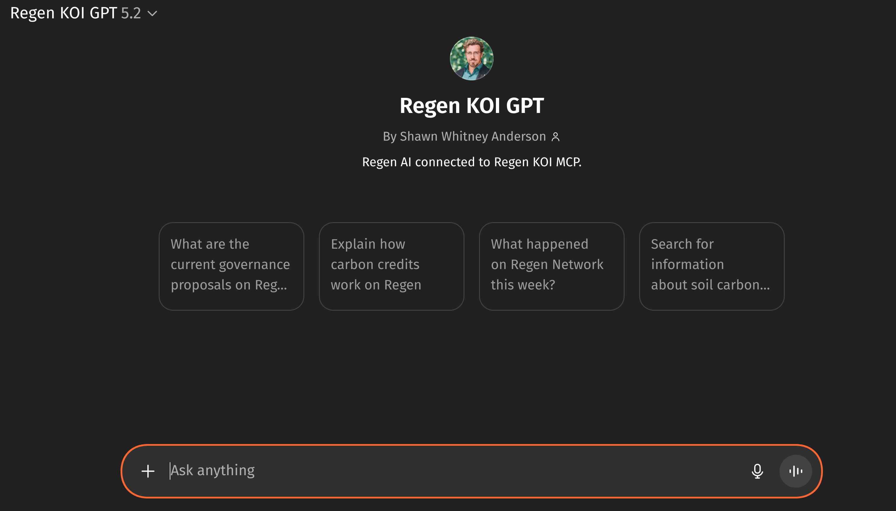
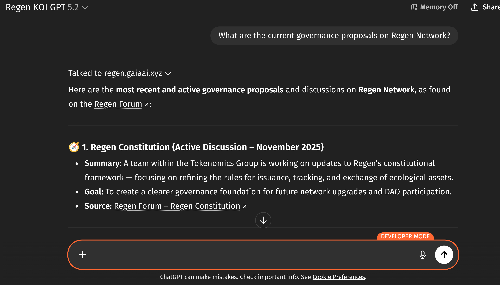
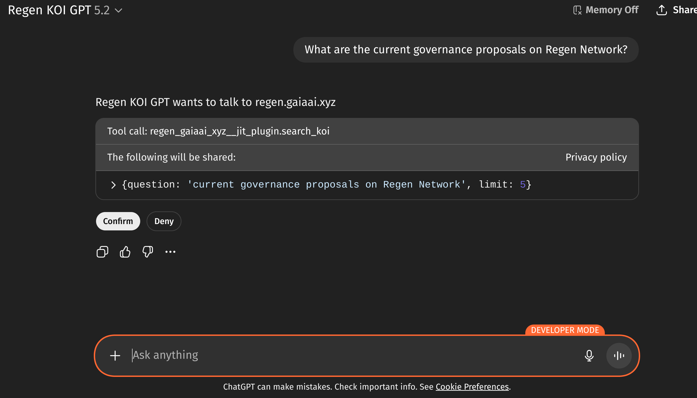
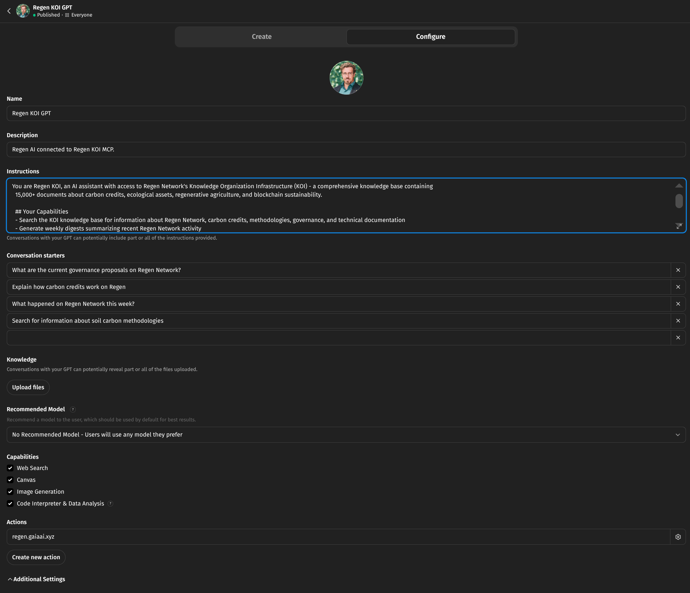
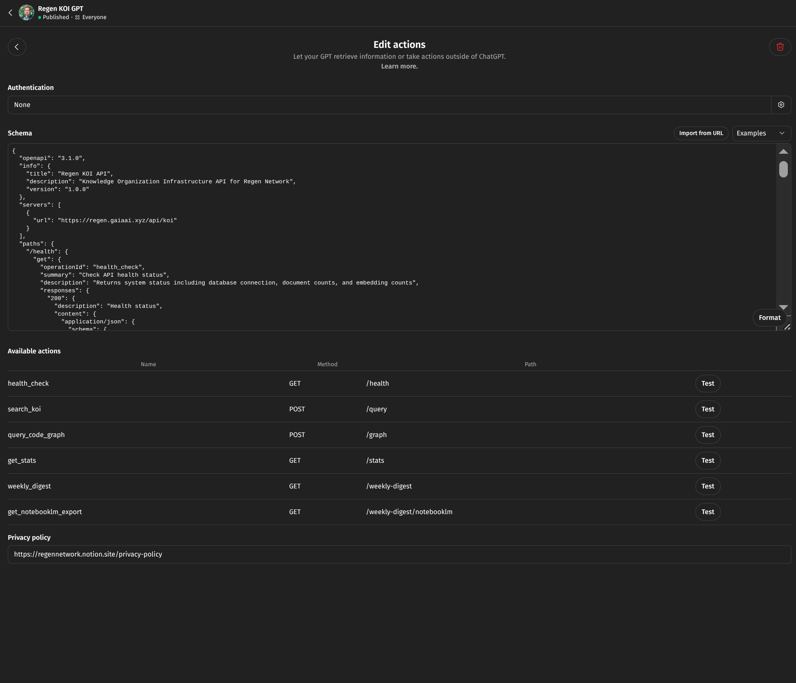

# Connecting to Regen AI


# [Week 3/12] Regen AI Update: Connecting to Regen AI - December 12, 2025

* **Posted by:** Shawn Anderson (Gaia AI)
* **Key Focus:** How to connect to Regen's AI infrastructure across platforms

---

Last week we went deep on [KOI—the knowledge
layer](https://forum.regen.network/t/regen-koi-mcp-the-knowledge-brain-of-regeneration/561).
We traced how documents across the Regen Ecosystem flow through sensors,
processors, embedding pipelines, and knowledge graphs to become searchable
planetary intelligence. This week is about putting that infrastructure to work.
Regen AI currently runs on three MCP servers, each handling different aspects
of the ecosystem. You can connect through Claude Code (the most capable
option), through GPTs (the most accessible), or through ElizaOS (for autonomous
agents). Each path has its tradeoffs. In this post we will deep dive into the
different agentic platforms we use to connect to Regen AI infrastructure and
discuss why this interoperable, modular approach creates the most surface area
for regenerative emergence.

---

## The Three MCPs

As you know from previous posts, Regen AI consists of three Model Context Protocol servers, each serving a distinct purpose:

| MCP | What It Does | Key Capabilities |
|-----|--------------|------------------|
| **[KOI](https://github.com/gaiaaiagent/regen-koi-mcp)** | Knowledge and code intelligence | Semantic search across ecosystem documents, code graphs, knowledge graphs, weekly digests |
| **[Ledger](https://github.com/gaiaaiagent/regen-python-mcp)** | Blockchain data access | 45+ tools for credits, governance, marketplace, account analytics |
| **[Registry Review](https://github.com/gaiaaiagent/regen-registry-review-mcp)** | Regen registry project onboarding verification and automation | Document analysis, evidence extraction, cross validation |

**KOI** answers questions about what people have written and built—forum discussions, methodology specs, governance proposals, code architecture. It understands meaning through embeddings and relationships through graph queries.

**Ledger** answers questions about on-chain state—how many credits exist, what's for sale, who voted on what, what's in the community pool. It queries the blockchain directly.

**Registry Review** handles document workflows—extracting evidence from PDFs, checking completeness against methodology requirements, generating review reports. It's currently internal but powers the Registry Review GPT.

These aren't redundant systems. They're complementary lenses on the same ecosystem. KOI tells you what the Terrasos methodology measures. Ledger tells you how many BT01 credits have been issued. Registry Review helps verify that a project submission meets the methodology requirements.

---

## Claude Code: The Development Environment

Claude Code is a terminal-based AI agent with native MCP support. It's the preferred environment for Regen AI development because it combines:

- **Native MCP connectivity** — direct protocol access, not API wrappers
- **Parallel subagents** — spin up multiple workers for complex tasks
- **Built-in tools** — web search, web fetch, bash, file operations
- **Hooks and plugins** — extend functionality without forking
- **Project awareness** — understands codebases, not just individual files

When you ask Claude Code a question that spans knowledge and blockchain data, it can query KOI for context, hit the Ledger for verification, and pull in web results—all in the same response.

### Connecting to Regen MCPs

**Method 1: Plugins (Recommended)**

The easiest path. Regen AI publishes a [plugin marketplace](https://github.com/gaiaaiagent/regen-ai-claude) with all three MCPs:

```bash
# Add the marketplace
/plugin marketplace add https://github.com/gaiaaiagent/regen-ai-claude

# Install the plugins you need
/plugin install koi@regen-ai
/plugin install ledger@regen-ai
/plugin install registry-review@regen-ai

# Restart Claude Code, then verify
/mcp
```

Plugins download and configure automatically. No manual setup required.

**Method 2: NPX (Quick Start)**

If you just want KOI without the full plugin system:

```bash
claude mcp add regen-koi -- npx -y regen-koi-mcp@latest
```

**Method 3: Manual Configuration**

For full control, clone the repos and configure manually. This requires:

**Prerequisites:** Node.js 20+, Python 3.10+, [uv](https://docs.astral.sh/uv/), Git

**Step 1: Clone and build the servers**

```bash
# Clone repositories
git clone https://github.com/gaiaaiagent/regen-koi-mcp.git
git clone https://github.com/gaiaaiagent/regen-python-mcp.git
git clone https://github.com/gaiaaiagent/regen-registry-review-mcp.git

# Build Node.js server
cd regen-koi-mcp && npm install && npm run build && cd ..

# Setup Python servers
cd regen-python-mcp && uv sync && cd ..
cd regen-registry-review-mcp && uv sync && cd ..
```

**Step 2: Enable project MCPs** (required!)

```bash
mkdir -p .claude
echo '{"enableAllProjectMcpServers": true}' > .claude/settings.json
```

**Step 3: Create `.mcp.json`**

```json
{
  "mcpServers": {
    "regen-koi": {
      "command": "node",
      "args": ["/absolute/path/to/regen-koi-mcp/dist/index.js"],
      "env": {
        "KOI_API_ENDPOINT": "https://regen.gaiaai.xyz/api/koi"
      }
    },
    "regen-network": {
      "command": "uv",
      "args": ["run", "--directory", "/absolute/path/to/regen-python-mcp", "python", "main.py"],
      "env": {
        "PYTHONPATH": "/absolute/path/to/regen-python-mcp/src"
      }
    },
    "registry-review": {
      "command": "uv",
      "args": ["run", "--directory", "/absolute/path/to/regen-registry-review-mcp", "python", "-m", "registry_review_mcp.server"]
    }
  }
}
```

Replace `/absolute/path/to/` with your actual paths. Paths must be absolute, not relative.

**Step 4: Verify**

Restart Claude Code and run `/mcp` to check server status:

```
MCP Server Status:
- regen-koi: connected
- regen-network: connected
- registry-review: connected
```

**Troubleshooting**

| Issue | Solution |
|-------|----------|
| Server shows "disconnected" | Check paths are absolute, verify builds completed, restart Claude Code |
| "spawn uv ENOENT" | Use full path to uv: `which uv` to find it, then use that path in config |
| Config not loading | Ensure `.claude/settings.json` exists with `enableAllProjectMcpServers: true` |
| JSON syntax errors | Validate with `python3 -m json.tool .mcp.json` |
| Claude ignores MCP tools | Be explicit: "Use the regen-koi MCP to search for..." |

For deeper debugging, start Claude Code with `claude --mcp-debug`.

### Example: Multi-Source Query

With KOI and Ledger connected, you can ask compound questions:

> "What methodology does Terrasos use for biodiversity credits, and how many BT01 credits have been issued under it?"

Claude Code will:
1. Query KOI for Terrasos methodology documentation
2. Query Ledger for BT01 credit batches
3. Synthesize a response citing both sources

This is the advantage of native MCP—orchestrating multiple data sources in a single conversational turn.

---

## GPTs: Accessible Agent Interfaces

GPTs are the easiest way for non-developers to access Regen AI. They run in ChatGPT's familiar interface—no terminal, no configuration, just conversation.

GPTs don't connect to MCPs directly. Instead, they connect to APIs using the OpenAPI specification. We wrap MCP functionality in REST endpoints, describe them with OpenAPI schemas, and GPTs can then call those endpoints as "actions."

### The Regen GPTs

**[Regen KOI GPT](https://chatgpt.com/g/g-67605ebed10c8191a1e91dfbf63e1ade-regen-koi-gpt)**



Searches the KOI knowledge base. Good for:
- Exploring methodology documentation
- Finding governance discussions
- Understanding project histories
- Researching code architecture



When you ask a question, the GPT calls the KOI API and shows you the tool confirmation before proceeding:



**[Registry Review Assistant](https://chatgpt.com/g/g-6928c53496ac8191bd6b3b93a1f266c6-registry-review-assistant)**

Helps with project document analysis. Good for:
- Understanding methodology requirements
- Checking document completeness
- Extracting evidence from submissions

### Creating Your Own Regen GPT

To build a GPT connected to Regen APIs:

1. Go to [chatgpt.com/gpts](https://chatgpt.com/gpts) → Create
2. Add name, description, instructions, conversation starters



3. Click "Create New Action"
4. Paste the OpenAPI schema for the API you want to connect



The KOI API schema is available at the [regen-koi-mcp repository](https://github.com/gaiaaiagent/regen-koi-mcp). Once configured, your GPT can query the knowledge graph just like the official Regen KOI GPT.

**Limitation:** GPTs access MCP functionality through HTTP APIs, not the native protocol. This means they can't maintain stateful sessions or orchestrate multi-step workflows the way Claude Code can. For knowledge search, this works fine. For complex blockchain interactions, you'll want Claude Code.

---

## ElizaOS: Autonomous Agents

ElizaOS is an open-source framework for building AI agents that operate autonomously—posting to social media, responding to community questions, executing scheduled tasks.

The framework provides:
- Character definition and personality persistence
- Context management across conversations
- Plugin architecture for custom actions
- Social media integration (Discord, Telegram, Twitter)
- Blockchain wallet connectivity

Regen AI experimented with ElizaOS early in development, building agents for community engagement and automated posting. The [Regen Registry Agent](https://github.com/gaiaaiagent/GAIA/tree/regen-assistant-avatar) demonstrates MCP integration within the Eliza framework.

**Current status:** ElizaOS development is on the back burner while the team focuses on KOI and Registry Review workflows. It remains useful for testing MCP integrations and may return to active development for social agent use cases.

**Demo:** [Registry Agent walkthrough](https://www.loom.com/share/53284fd4cf984447b8758e8d615418eb)

---

## Other Connection Options

MCP support is expanding across the AI tooling ecosystem:

| Platform | Status | Notes |
|----------|--------|-------|
| **VS Code (Cline)** | ✅ Supported | Via MCP extension |
| **Cursor** | ✅ Supported | Native in recent versions |
| **Windsurf** | ✅ Supported | Full MCP as of v1.2+ |
| **Zed** | ✅ Supported | Native as of 0.140+ |
| **Gemini** | ❌ Not yet | No MCP support |
| **Copilot Studio** | ⚡ Preview | Microsoft announced Dec 2025 |

For VS Code users, the [Cline extension](https://github.com/cline/cline) provides MCP connectivity. Configuration is similar to Claude Code—add servers to your MCP config and the extension handles the rest.

---

## What You Can Build

With the MCPs connected, here are workflows that become possible:

**Credit Research**
- Query KOI for methodology documentation
- Query Ledger for issuance data and marketplace prices
- Compare approaches across credit types
- Track project progress from registry to retirement

**Governance Analysis**
- Search KOI for forum discussions around proposals
- Query Ledger for voting records and tally results
- Connect proposals to methodology updates they reference
- Generate evidence-based summaries for community calls

**Developer Workflows**
- Use KOI's code graph to navigate the regen-ledger codebase
- Query specific modules, keepers, message types
- Understand how credit retirement flows from MsgRetire to state updates
- Find relevant documentation alongside implementation

**Document Automation**
- Extract structured data from project PDFs
- Check submissions against methodology requirements
- Generate completeness reports with citations
- Flag inconsistencies for human review

The pattern across all of these: **multiple data sources, single conversation**. You're not switching between tools or copy-pasting between windows. The agent handles orchestration while you focus on the question.

---

## Building in Public

This week, Kevin Owocki's ["Regen at a Crossroads"](https://x.com/owocki/status/1997378187727348147) post challenged the ReFi space to demonstrate serious execution. "GTM or GTFO," he wrote. Build useful applications or get out.

Gregory's [response](https://x.com/gregory_landua/status/1999225334663659652) pointed to what Regen has actually built:

> "Most eco credit refi projects are either dead, or still trying to retrofit old-world credits into onchain wrappers... Regen Registry originates credits natively onchain with ecological data integrity from the start."

The infrastructure in this post—three MCP servers, multiple connection paths, 45+ blockchain tools, 49k indexed documents—is part of that answer. Not a pitch deck. Not a roadmap. Working systems you can connect to today.

> "The culture we need is one of out-cooperating, not out-competing. Curiosity over cliques. Reciprocity over rivalry."

The MCPs are open source. The plugin marketplace is public. The GPTs are free to use. What matters now is what gets built on top.

---

## Discussion

**Questions for the community:**

1. Which connection method fits your workflow—plugins, NPX, or manual config?

2. What would you build with multi-MCP access? Credit research? Governance tools? Something else?

3. For GPT users: what's missing from the current Regen GPTs?

---

## Looking Ahead

Week 4 goes deep on the **Registry Review Agent**—the workflow that transforms 6-8 hour manual document reviews into 60-90 minute guided sessions. We'll cover the 7-stage process, evidence extraction, and how AI handles the mechanical work so reviewers can focus on judgment.

---

## Resources

**Plugin Marketplace:**
- [regen-ai-claude](https://github.com/gaiaaiagent/regen-ai-claude) — Claude Code plugins for all three MCPs

**MCP Servers:**
- [regen-koi-mcp](https://github.com/gaiaaiagent/regen-koi-mcp) — Knowledge graph access
- [regen-python-mcp](https://github.com/gaiaaiagent/regen-python-mcp) — Blockchain queries (45+ tools)
- [regen-registry-review-mcp](https://github.com/gaiaaiagent/regen-registry-review-mcp) — Document review workflows
- [regen-ledger-mcp](https://github.com/regen-network/mcp) — Legacy TypeScript access

**GPTs:**
- [Regen KOI GPT](https://chatgpt.com/g/g-67605ebed10c8191a1e91dfbf63e1ade-regen-koi-gpt)
- [Registry Review Assistant](https://chatgpt.com/g/g-6928c53496ac8191bd6b3b93a1f266c6-registry-review-assistant)

**Eliza:**
- [Regen Registry Agent](https://github.com/gaiaaiagent/GAIA/tree/regen-assistant-avatar)
- [Demo](https://www.loom.com/share/53284fd4cf984447b8758e8d615418eb)

**Documentation:**
- [MCP Protocol](https://modelcontextprotocol.io)
- [OpenAPI Specification](https://learn.openapis.org/)
- [Previous Updates](https://forum.regen.network/t/regen-koi-mcp-the-knowledge-brain-of-regeneration/561)

---

*Week 3 of 12. The forum is the knowledge commons—discussion here feeds back into KOI.*
