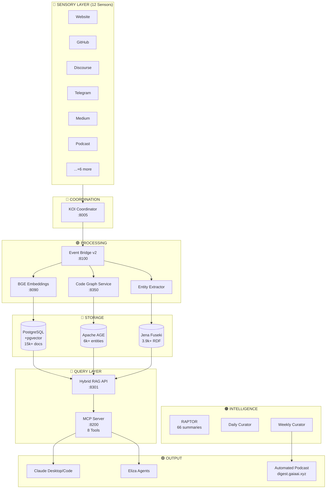

# RegenAI KOI Architecture - Visual Diagram Reference

## Master Diagram Layout

```
╔══════════════════════════════════════════════════════════════════════════════════════════════════════════════╗
║                                       REGENAI KOI ARCHITECTURE v2.0                                          ║
║                                  "The Mycelial Mind of Regenerative AI"                                       ║
╠══════════════════════════════════════════════════════════════════════════════════════════════════════════════╣
║                                                                                                               ║
║  ┌──────────────────────────────────────── SENSORY LAYER ────────────────────────────────────────────┐       ║
║  │                                        (12 Active Sensors)                                         │       ║
║  │                                                                                                    │       ║
║  │  ┌────────────────────────────── DOCUMENTATION (5) ──────────────────────────────┐                │       ║
║  │  │ ┌──────────┐ ┌──────────┐ ┌──────────┐ ┌──────────┐ ┌──────────┐              │                │       ║
║  │  │ │ Website  │ │  GitHub  │ │  GitHub  │ │  GitLab  │ │  Notion  │              │                │       ║
║  │  │ │  Sensor  │ │  Sensor  │ │ Activity │ │  Sensor  │ │  Sensor  │              │                │       ║
║  │  │ │   🔵     │ │    🔵    │ │    🔵    │ │    🔵    │ │    🔵    │              │                │       ║
║  │  │ └────┬─────┘ └────┬─────┘ └────┬─────┘ └────┬─────┘ └────┬─────┘              │                │       ║
║  │  └──────┼────────────┼────────────┼────────────┼────────────┼────────────────────┘                │       ║
║  │         │            │            │            │            │                                      │       ║
║  │  ┌──────┼────────────────────── COMMUNITY (4) ─┼────────────┼────────────────────┐                │       ║
║  │  │ ┌────┴─────┐ ┌──────────┐ ┌────┴─────┐ ┌────┴─────┐                           │                │       ║
║  │  │ │Discourse │ │ Telegram │ │ Twitter  │ │ Discord  │                           │                │       ║
║  │  │ │  Sensor  │ │  Sensor  │ │  Sensor  │ │  Sensor  │                           │                │       ║
║  │  │ │   🟢     │ │    🟢    │ │    🟢    │ │    🟢    │                           │                │       ║
║  │  │ └────┬─────┘ └────┬─────┘ └────┬─────┘ └────┬─────┘                           │                │       ║
║  │  └──────┼────────────┼────────────┼────────────┼─────────────────────────────────┘                │       ║
║  │         │            │            │            │                                                   │       ║
║  │  ┌──────┼────── MEDIA (2) ────────┼────────────┼───────── BLOCKCHAIN (1) ────────┐                │       ║
║  │  │ ┌────┴─────┐ ┌──────────┐      │            │          ┌──────────┐           │                │       ║
║  │  │ │  Medium  │ │ Podcast  │      │            │          │  Ledger  │           │                │       ║
║  │  │ │  Sensor  │ │  Sensor  │      │            │          │  Sensor  │           │                │       ║
║  │  │ │   🟠     │ │    🟠    │      │            │          │    🟣    │           │                │       ║
║  │  │ └────┬─────┘ └────┬─────┘      │            │          └────┬─────┘           │                │       ║
║  │  └──────┼────────────┼────────────┼────────────┼───────────────┼─────────────────┘                │       ║
║  └─────────┼────────────┼────────────┼────────────┼───────────────┼──────────────────────────────────┘       ║
║            │            │            │            │               │                                           ║
║            └────────────┴────────────┴────────────┴───────────────┘                                           ║
║                                     │                                                                ║
║                                     ▼                                                                ║
║  ┌───────────────────────── COORDINATION HUB ─────────────────────────┐                             ║
║  │                    ┌───────────────────────┐                        │                             ║
║  │                    │    KOI COORDINATOR    │                        │                             ║
║  │                    │      Port 8005        │                        │                             ║
║  │                    │         🔴            │                        │                             ║
║  │                    │  • Node Registration  │                        │                             ║
║  │                    │  • Event Routing      │                        │                             ║
║  │                    │  • Network Topology   │                        │                             ║
║  │                    └───────────┬───────────┘                        │                             ║
║  └────────────────────────────────┼────────────────────────────────────┘                             ║
║                                   │                                                                  ║
║                                   ▼                                                                  ║
║  ┌───────────────────────── PROCESSING LAYER ─────────────────────────┐                             ║
║  │                    ┌───────────────────────┐                        │                             ║
║  │                    │   EVENT BRIDGE v2     │                        │                             ║
║  │                    │      Port 8100        │                        │                             ║
║  │                    │         🟣            │                        │                             ║
║  │                    │  • Deduplication      │                        │                             ║
║  │                    │  • Versioning         │                        │                             ║
║  │                    │  • Queue Management   │                        │                             ║
║  │                    └───────────┬───────────┘                        │                             ║
║  │                                │                                    │                             ║
║  │         ┌──────────────────────┼──────────────────────┐            │                             ║
║  │         │                      │                      │            │                             ║
║  │         ▼                      ▼                      ▼            │                             ║
║  │  ┌─────────────┐       ┌─────────────┐       ┌─────────────┐       │                             ║
║  │  │     BGE     │       │ CODE GRAPH  │       │   ENTITY    │       │                             ║
║  │  │ EMBEDDINGS  │       │  SERVICE    │       │ EXTRACTOR   │       │                             ║
║  │  │  Port 8090  │       │  Port 8350  │       │             │       │                             ║
║  │  │     🟣      │       │     🟣      │       │     🟣      │       │                             ║
║  │  │             │       │             │       │             │       │                             ║
║  │  │ 1024-dim    │       │ 6,278       │       │ Semantic    │       │                             ║
║  │  │ vectors     │       │ entities    │       │ extraction  │       │                             ║
║  │  └──────┬──────┘       └──────┬──────┘       └──────┬──────┘       │                             ║
║  └─────────┼─────────────────────┼─────────────────────┼──────────────┘                             ║
║            │                     │                     │                                             ║
║            ▼                     ▼                     ▼                                             ║
║  ┌───────────────────────── STORAGE LAYER ────────────────────────────┐                             ║
║  │                                                                     │                             ║
║  │  ┌─────────────────┐  ┌─────────────────┐  ┌─────────────────┐     │                             ║
║  │  │   POSTGRESQL    │  │   APACHE AGE    │  │  APACHE JENA    │     │                             ║
║  │  │   + pgvector    │  │  (Graph Ext.)   │  │    FUSEKI       │     │                             ║
║  │  │   Port 5432     │  │                 │  │   Port 3030     │     │                             ║
║  │  │      🩷         │  │       🩷        │  │      🩷         │     │                             ║
║  │  │                 │  │                 │  │                 │     │                             ║
║  │  │ • 15,000+ docs  │  │ • 6,278 nodes   │  │ • 3,900+ RDF    │     │                             ║
║  │  │ • Vector search │  │ • 16,445 edges  │  │ • SPARQL query  │     │                             ║
║  │  │ • Full text     │  │ • Code entities │  │ • Ontologies    │     │                             ║
║  │  └────────┬────────┘  └────────┬────────┘  └────────┬────────┘     │                             ║
║  └───────────┼────────────────────┼────────────────────┼──────────────┘                             ║
║              │                    │                    │                                             ║
║              └────────────────────┼────────────────────┘                                             ║
║                                   │                                                                  ║
║                                   ▼                                                                  ║
║  ┌───────────────────────── QUERY & ACCESS LAYER ─────────────────────┐                             ║
║  │                                                                     │                             ║
║  │  ┌─────────────────────────────────────────────────────────────┐   │                             ║
║  │  │                     HYBRID RAG API                           │   │                             ║
║  │  │                       Port 8301                              │   │                             ║
║  │  │                          🩵                                  │   │                             ║
║  │  │   ┌─────────────┐ ┌─────────────┐ ┌─────────────┐           │   │                             ║
║  │  │   │   Vector    │ │    Graph    │ │   Keyword   │           │   │                             ║
║  │  │   │   Search    │+│  Traverse   │+│    Match    │ = RRF     │   │                             ║
║  │  │   └─────────────┘ └─────────────┘ └─────────────┘           │   │                             ║
║  │  └─────────────────────────┬───────────────────────────────────┘   │                             ║
║  │                            │                                        │                             ║
║  │  ┌─────────────────────────┴───────────────────────────────────┐   │                             ║
║  │  │                      MCP SERVER                              │   │                             ║
║  │  │                      Port 8200                               │   │                             ║
║  │  │                         🩵                                   │   │                             ║
║  │  │  ┌────────────────────────────────────────────────────────┐ │   │                             ║
║  │  │  │              8 MCP TOOLS FOR AI AGENTS                 │ │   │                             ║
║  │  │  │                                                        │ │   │                             ║
║  │  │  │  • search_knowledge     • query_code_graph             │ │   │                             ║
║  │  │  │  • hybrid_search        • get_repo_overview            │ │   │                             ║
║  │  │  │  • search_github_docs   • get_tech_stack               │ │   │                             ║
║  │  │  │  • get_stats            • generate_weekly_digest       │ │   │                             ║
║  │  │  └────────────────────────────────────────────────────────┘ │   │                             ║
║  │  └─────────────────────────────────────────────────────────────┘   │                             ║
║  └─────────────────────────────┬───────────────────────────────────────┘                             ║
║                                │                                                                     ║
║         ┌──────────────────────┼──────────────────────┐                                              ║
║         │                      │                      │                                              ║
║         ▼                      ▼                      ▼                                              ║
║  ┌───────────────────────── INTELLIGENCE LAYER ───────────────────────┐                             ║
║  │                                                                     │                             ║
║  │  ┌─────────────────┐  ┌─────────────────┐  ┌─────────────────┐     │                             ║
║  │  │     RAPTOR      │  │  DAILY CURATOR  │  │ WEEKLY CURATOR  │     │                             ║
║  │  │   SUMMARIES     │  │                 │  │                 │     │                             ║
║  │  │      🟠         │  │       🟠        │  │       🟠        │     │                             ║
║  │  │                 │  │                 │  │                 │     │                             ║
║  │  │ 66 module       │  │ Daily patterns  │  │ Weekly digest   │     │                             ║
║  │  │ summaries       │  │ & highlights    │  │ generation      │     │                             ║
║  │  └─────────────────┘  └─────────────────┘  └────────┬────────┘     │                             ║
║  └──────────────────────────────────────────────────────┼──────────────┘                             ║
║                                                         │                                            ║
║         ┌───────────────────────────────────────────────┼──────────────────┐                         ║
║         │                                               │                  │                         ║
║         ▼                                               ▼                  ▼                         ║
║  ┌───────────────────────── OUTPUT LAYER ─────────────────────────────────┐                         ║
║  │                                                                         │                         ║
║  │  ┌─────────────────┐  ┌─────────────────┐  ┌─────────────────┐         │                         ║
║  │  │ CLAUDE DESKTOP  │  │  ELIZA AGENTS   │  │ AUTOMATED       │         │                         ║
║  │  │ / CLAUDE CODE   │  │                 │  │ PODCAST         │         │                         ║
║  │  │      🟢         │  │       🟢        │  │       🟢        │         │                         ║
║  │  │                 │  │                 │  │                 │         │                         ║
║  │  │ Human users     │  │ Community       │  │ digest.gaiaai   │         │                         ║
║  │  │ AI assistants   │  │ engagement      │  │ .xyz            │         │                         ║
║  │  └─────────────────┘  └─────────────────┘  └─────────────────┘         │                         ║
║  │                                                                         │                         ║
║  │  ┌─────────────────┐                                                   │                         ║
║  │  │   DASHBOARD     │                                                   │                         ║
║  │  │   Port 8400     │                                                   │                         ║
║  │  │      🟢         │                                                   │                         ║
║  │  │ Real-time       │                                                   │                         ║
║  │  │ monitoring      │                                                   │                         ║
║  │  └─────────────────┘                                                   │                         ║
║  └─────────────────────────────────────────────────────────────────────────┘                         ║
║                                                                                                       ║
╠══════════════════════════════════════════════════════════════════════════════════════════════════════════════╣
║  KEY METRICS: 15,000+ docs │ 6,278 code entities │ 3,900+ RDF triples │ 7 MCP tools │ 12 sensors │ 5 repos    ║
╚══════════════════════════════════════════════════════════════════════════════════════════════════════════════╝
```

---

## Simplified Flow Diagram

```
┌─────────────────────────────────────────────────────────────────────────┐
│                         REGENAI KOI FLOW                                 │
└─────────────────────────────────────────────────────────────────────────┘

   SENSORS (12)                    COORDINATOR                 PROCESSORS
 ┌──────────────┐                ┌─────────────┐            ┌─────────────┐
 │ Website      │──┐             │             │            │ Embeddings  │
 │ GitHub       │──┤             │     KOI     │            │ (BGE/OpenAI)│
 │ GitHub Act.  │──┤             │ COORDINATOR │            └──────┬──────┘
 │ GitLab       │──┤  FUN Events │  :8005      │ Routes to        │
 │ Discourse    │──┼────────────►│             │────────────►      │
 │ Telegram     │──┤             └─────────────┘            ┌──────▼──────┐
 │ Twitter      │──┤                                        │ Code Graph  │
 │ Discord      │──┤                                        │   :8350     │
 │ Medium       │──┤                                        └──────┬──────┘
 │ Podcast      │──┤                                               │
 │ Notion       │──┤                                               │
 │ Ledger       │──┘                                               │
 └──────────────┘                                                  │
                                                                   │
                                                                   ▼
   STORAGE                                                  ┌─────────────┐
 ┌──────────────┐              ┌─────────────┐              │   Entity    │
 │ PostgreSQL   │◄─────────────│ Event Bridge│◄─────────────│  Extractor  │
 │ + pgvector   │              │    :8100    │              └─────────────┘
 │              │              └─────────────┘
 │ 15,000+ docs │
 └──────┬───────┘
        │         ┌─────────────┐
        │         │ Apache AGE  │
        ├────────►│ Code Graph  │
        │         │ 6,278 nodes │
        │         └─────────────┘
        │         ┌─────────────┐
        └────────►│ Jena Fuseki │
                  │ 3,900+ RDF  │
                  └──────┬──────┘
                         │
                         ▼
   QUERY LAYER                                               AI CONSUMERS
 ┌──────────────────────┐                                  ┌──────────────┐
 │   HYBRID RAG API     │     ┌─────────────┐              │ Claude       │
 │      :8301           │────►│ MCP SERVER  │─────────────►│ Desktop      │
 │                      │     │   :8200     │              ├──────────────┤
 │ Vector + Graph +     │     │             │              │ Eliza Agents │
 │ Keyword = RRF        │     │ 8 Tools     │              ├──────────────┤
 └──────────────────────┘     └─────────────┘              │ Podcast Gen  │
                                                           └──────────────┘
```

---

## Color Legend

| Color | Hex Code | Layer | Usage |
|-------|----------|-------|-------|
| 🔵 Blue | #3B82F6 | Sensors | Documentation sensors |
| 🟢 Green | #22C55E | Sensors/Output | Community sensors, outputs |
| 🟠 Orange | #F97316 | Sensors/Intelligence | Media sensors, curators |
| 🟣 Purple | #A855F7 | Sensors/Processors | Blockchain, processing nodes |
| 🔴 Red | #EF4444 | Coordination | Central hub |
| 🩷 Pink | #EC4899 | Storage | Database nodes |
| 🩵 Cyan | #06B6D4 | Services | Query/access layer |

---

## Component Sizes (Relative)

- **Coordinator**: Large, central, prominent
- **Event Bridge**: Medium, clearly visible pipeline
- **Sensors**: Small uniform boxes, arranged in groups
- **Storage nodes**: Medium, equal prominence
- **MCP Server**: Large, as primary interface
- **Hybrid RAG**: Medium, showing the fusion

---

## Suggested Tool: Canva/Figma

1. Use **layered sections** with clear headers
2. **Rounded rectangles** for nodes
3. **Arrows with labels** for data flow
4. **Color-coded groupings** per layer
5. **Port numbers** as small badges
6. **Metrics callouts** in footer or sidebar
7. **Legend** in corner

---

## Alternative: Mermaid Diagram



This Mermaid diagram can be rendered in GitHub, Notion, or many documentation tools for a quick visual reference.
